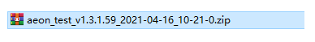

# 背景介绍

[[toc]]

**以志强哥（）的视角来简单的聊聊**

### :zero: ZIP 文件携带有效信息过少（如构建分支、描述信息）

::: tip 这是一个故事
那是一个风和日丽、普天同乐的 happyFriday，志强哥慢悠悠的收拾着东西，准备着下班的冲刺。忽然间，一个黑影拍了拍**志强哥**的肩膀说道：'一键加购需求今天上线吧'。闻声望去，没有错，此人正是前端组老大哥 **腾哥**，江湖人称 **车神 Plus** 。
 
说时迟那时快，话音刚落地，**志强哥**已经劈里啪啦的敲完 **`npm run build:prod`** 命令，最后重重的落在了 **`Enter`** 键上，检查请求环境、上传，行云流水，**腾哥**直呼 "**好家伙，这么快**"，**志强哥**得意的说道 "**我一向都很快，你不是很清楚的吗**"
 
提审、上线一切如常，**辉哥**
:::

### :one: 不允许私人交付应用测试包，交付成本高、流程繁琐。

::: tip 这也是一个故事
node 不是一门语言而是一个环境、一个平台，可以让 javascrip 运行在服务端。
:::

Node.js 是一个基于 Chrome JavaScript 运行时建立的一个平台。
Node.js 是一个事件驱动 I/O 服务端 JavaScript 环境，基于 Google 的 V8 引擎，V8 引擎执行 Javascript 的速度非常快，性能非常好。

### 1

### 2

### 3

### 4
