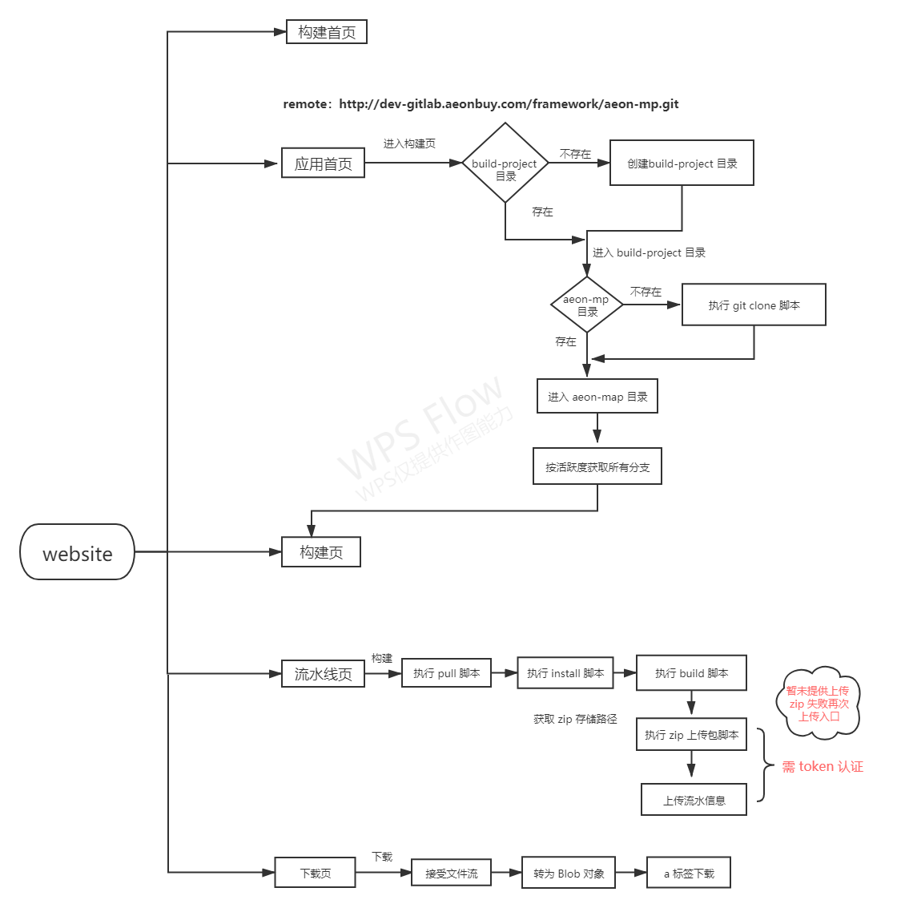
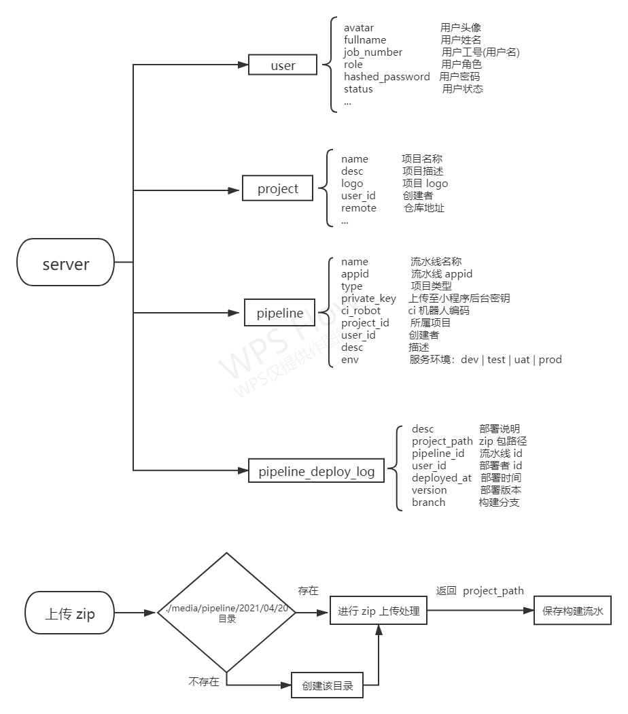

# 项目架构

**辉腾负责操刀设计**

**靓仔负责落地开发**

### 技术选型

---

**前端：Next.js**

原因：

- React 服务端渲染框架实践
- 构建脚本前端、服务端执行的多种选择

**服务端：Nest.js**

原因：

- 提供了开箱即用的应用体系（Router、Guards、Orm、Swagger）
- 完美集成 TS

### 架构

---

#### website

#### server

### 遇到的问题

---

- 构建脚本功能放 website 端还是 server 端 ？
- 为什么 `pull` `instll` `build` `upload` 构建脚本要分开写 ？
- 接入不同的项目版本号如何管理，构建脚本怎么统一 ？
- 上传 zip、流水 脚本在服务端执行，怎样拿到 token ？
