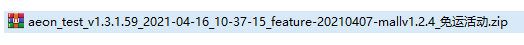

# 方案定制

### 1. zip 名信息过少问题
---

获取构建分支、描述信息
```shell
git name-rev --name-only HEAD
```
**优化前** 


**优化后** 




### 2. 交付繁琐问题
---


**1. node 脚本（使用如 nodemailer 包在构建完成后将 zip 包等信息通过邮件进行发送）**
优点|缺点
---|:--:
工作量较小|邮件中检索对应的 zip 包困难，没有可视化界面


**2. jenkins（使用 Git parameter 插件实现指定 branch、tag 进行构建，将 zip 包等信息通过邮件发送）**

优点|缺点
---|:--:
工作量小|邮件中检索对应的 zip 包困难，没有可视化界面


**3. 自建构建平台，对构建信息进行存储、提供可视化界面**

优点|缺点
---|:--:
可视化构建平台、对构建信息进行存储管理|工作量大

**4.**

**5.**
