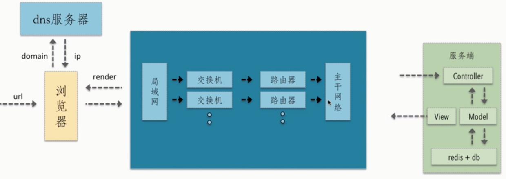
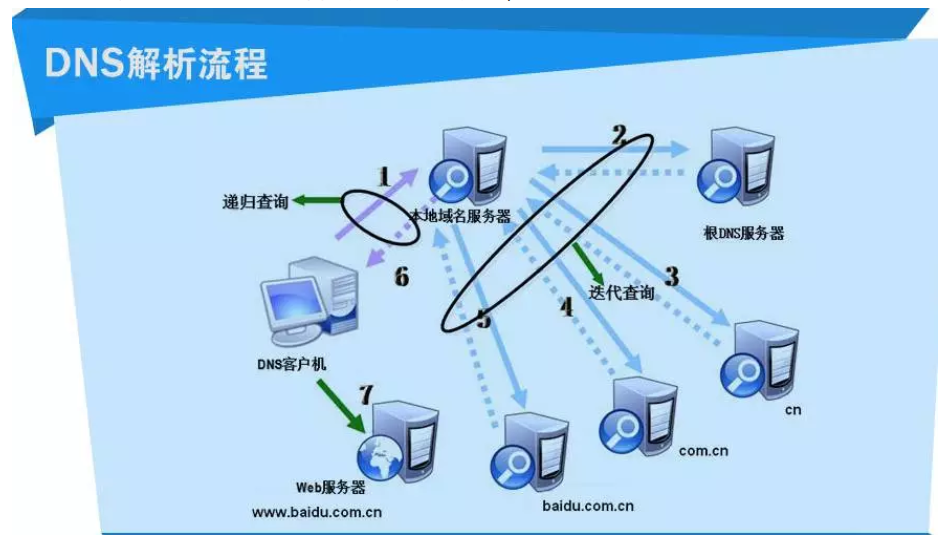
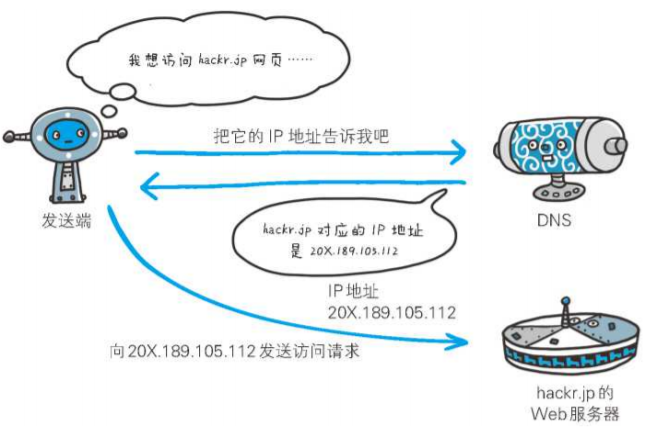
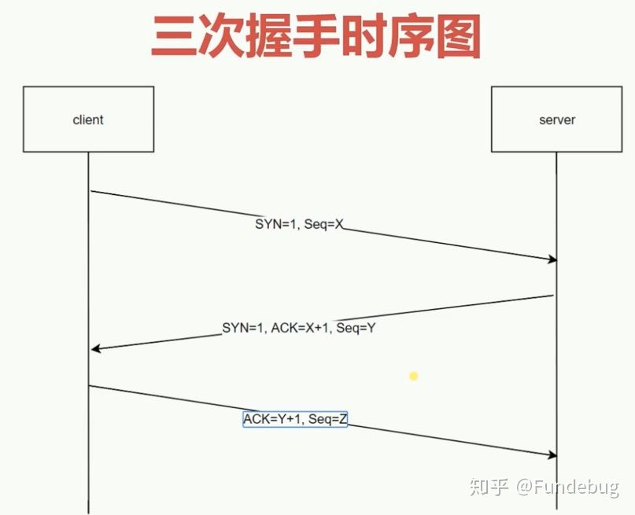
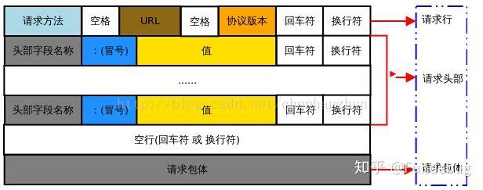
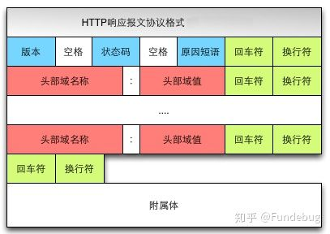
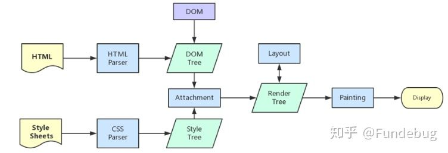
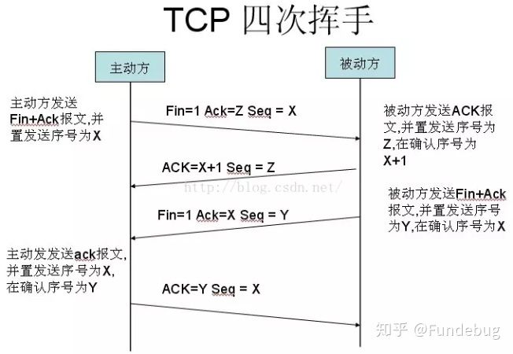

# 浏览器
## url 到页面展示的过程
###  前言
  从浏览器输入 url 回车到页面展示内容到底发生了些什么？大致过程如下图示:
  
  总体来说分为以下几个过程  
  - DNS 解析（域名解析为 ip）
  - TCP 链接（三次握手）
  - 发送 HTTP 请求
  - 服务器处理请求并返回请求报文
  - 浏览器解析渲染页面
  - 断开 TCP 链接（四次挥手）   

  带着疑问来了解这个知识点会更加的牢固和有拓展性。比如：  
  1 析 DNS 分为哪几个阶段？   
  2 每次解析的 ip 都一样吗？  
  3 每次都会解析吗？  
  4 请求报文由什么组成？  
  5 三次握手、四次挥手分别是什么？  
  6 二次握手、四次握手不可以吗？为什么是三次握手？

  ### 1、DNS 解析
  输入访问网址后，需要经过域名解析，因为浏览器并不能直接的根据域名找到对应的服务器，而是通过 ip 地址进行访问。如果访问的地址直接是 ip 地址的话则不需要 DNS 解析。
  1. IP 地址  
  `IP 地址是指互联网协议地址，是 IP Address 的缩写。IP 地址是 IP 协议提供的一种统一的地址格式，它为互联网上的每一个网络和每一台主机分配一个逻辑地址，以此来屏蔽物理地址的差异。`
  2. 什么是域名解析   
  `DNS 协议提供通过域名查找 IP 地址，或逆向从 IP 地址反查域名的服务。DNS 是一个网络服务器，我们的域名解析简单来说就是在 DNS 上记录一条信息记录。`
  3. 浏览器如何通过域名去查询 URL 对应的 IP 呢？  
  `DNS域名解析分为递归查询和迭代查询两种方式，现一般为迭代查询`

  **DNS的优化与应用**
  1. DNS 缓存   
  `DNS存在着多级缓存，从离浏览器的距离排序的话，有以下几种: 浏览器缓存，系统缓存，路由器缓存，IPS服务器缓存，根域名服务器缓存，顶级域名服务器缓存，主域名服务器缓存。`
  2. DNS 负载均衡   
  `(DNS重定向) DNS负载均衡技术的实现原理是在DNS服务器中为同一个主机名配置多个IP地址，在应答DNS查询时， DNS服务器对每个查询将以DNS文件中主机记录的IP地址按顺序返回不同的解析结果，将客户端的访问 引导到不同的机器上去，使得不同的客户端访问不同的服务器，从而达到负载均衡的目的。`
  - 大家耳熟能详的CDN(Content Delivery Network)就是利用DNS的重定向技术，DNS服务器会返回一个跟 用户最接近的点的IP地址给用户，CDN节点的服务器负责响应用户的请求，提供所需的内容。
  3. dns-prefetch DNS Prefetch 是一种 DNS 预解析技术    
  `当你浏览网页时，浏览器会在加载网页时对网页中的域名进行解析缓存，这样在你单击当前网页中的连接时就无需进行 DNS 的解析，减少用户等待时间，提高用户体验。`

  **依次解析顺序：浏览器缓存 -> 系统缓存 -> 路由缓存 -> IPS 服务器缓存 -> 根域名服务器缓存 -> 顶级域名服务器缓存 -> 主域名服务器缓存**
  

  小结：DNS 解析获得对应的 IP 地址，然后返回给浏览器，浏览器再将 IP 地址打在协议上，同时请求参数也会在协议搭载，然后一并发送给对应的服务器。接下来介绍向服务器发送 HTTP 请求阶段，HTTP 请求分为三个部分：TCP 三次握手、http 请求响应信息、关闭 TCP 连接。

  

  ### 2、TCP链接
  在客户端发送数据之前会发起 TCP 三次握手以同步客户端和服务端的序列号、确认号，并交互 TCP 窗口大小信息

  

  **TCP 三次握手过程**
  - 客户端发送一个 SYN=1, Seq=x 的数据包到服务端
  - 服务端发回一个 SYN=1, ACK=x+1, Seq=Y 的响应包以示确认信息
  - 客户端回传一个 ACK=Y+1, Seq=Z 的数据包到服务器，表示握手结束

  为什么需要三次握手 ？   
  **为了防止已失效的请求连接的请求报文又发送到服务器，因此产生错误**

  ### 3、发送 HTTP 请求
  TCP 三次握手后发送 HTTP 请求报文。
  HTTP 请求报文由请求行、请求头、请求体组成    
  
  1. 请求行包含请求方法、url、协议版本
  - 请求方法包含 8 种：GET、POST、PUT、DELETE、PATCH、HEAD、OPTIONS、TRACE
  - URL 即请求地址，由 <协议>：//<主机>：<端口>/<路径>?<参数> 组成
  - 协议版本即 http 版本号
  `POST /chapter17/user.html HTTP/1.1`    
  2. 请求头包含请求的附加信息，由关键字/值对组成，每行一对，关键字和值用英文冒号“:”分隔

  请求头部通知服务器有关于客户端请求的信息。它包含许多有关的客户端环境和请求正文的有用信息。其中比如：Host，表示主机名，虚拟主机；Connection,HTTP/1.1 增加的，使用 keepalive，即持久连接，一个连接可以发多个请求；User-Agent，请求发出者，兼容性以及定制化需求

  3. 请求体，可以承载多个请求参数的数据，包含回车符、换行符和请求数据，并不是所有请求都具有请求数据

  ### 4、服务器处理请求并返回请求报文
  详细内容暂略~   

  - 响应报文
  响应报文由响应行、响应头、响应体组成    
  
  1. 响应行包含：协议版本，状态码，状态码描述
  - 1xx：指示信息--表示请求已接收，继续处理。
  - 2xx：成功--表示请求已被成功接收、理解、接受。
  - 3xx：重定向--要完成请求必须进行更进一步的操作。
  - 4xx：客户端错误--请求有语法错误或请求无法实现。
  - 5xx：服务器端错误--服务器未能实现合法的请求。
  2. 响应头部包含响应报文的附加信息，由 名/值 对组成
  3. 响应主体包含回车符、换行符和响应返回数据，并不是所有响应报文都有响应数据

  ### 5、浏览器解析渲染页面
  浏览器拿到响应的 HTML 后解析渲染页面    
  

  大致分为以下几个过程：
  - 根据 html 解析生成 DOM 树
  - 根据 css 解析生成 CSS 规则树
  - 结合 DOM 树和 CSS 规则树渲染 render 树
  - 根据 render 树计算每个节点的信息
  - 根据计算的节点信息进行页面绘制

  **1、根据 HTML 解析 DOM 树**
  - DOM 树的解析过程是 深度遍历优先，先解析当前节点的子节点再解析兄弟节点
  - 解析 DOM 树的过程中如遇到 `script` 标签且没有 `async` `defer` 属性 则停止 DOM 树的解析直到 js 执行完毕
  
  **2、根据 CSS 生成 CSS 规则树**
  - 解析 CSS 规则树时暂停 js 的执行，知道 CSS 规则树解析完毕
  - 浏览器在 CSS 规则树生成之前是不会进行渲染

  **3、结合 DOM 树和 CSS 规则树**
  - DOM 树和 CSS 规则树全部准备好了以后，浏览器才会开始构建渲染树
  - 精简 CSS 可以加快 CSS 规则树的构建，从而加快页面相应速度

  **4、根据渲染树计算每一个节点的信息（布局）**
  - 布局：通过渲染树中渲染对象的信息，计算出每一个渲染对象的位置和尺寸
  - 回流：在布局完成后，发现了某个部分发生了变化影响了布局，那就需要倒回去重新渲染。

  **5、根据计算好的信息绘制页面**
  - 绘制阶段，系统会遍历呈现树，并调用呈现器的“paint”方法，将呈现器的内容显示在屏幕上
  - 重绘：某个元素的背景颜色，文字颜色等，不影响元素周围或内部布局的属性，将只会引起浏览器的重绘
  - 回流：某个元素的尺寸发生了变化，则需重新计算渲染树，重新渲染

  ### 6、断开链接
  当数据传输完毕后需要断开 TCP 链接，此时发起 TCP 四次挥手

  